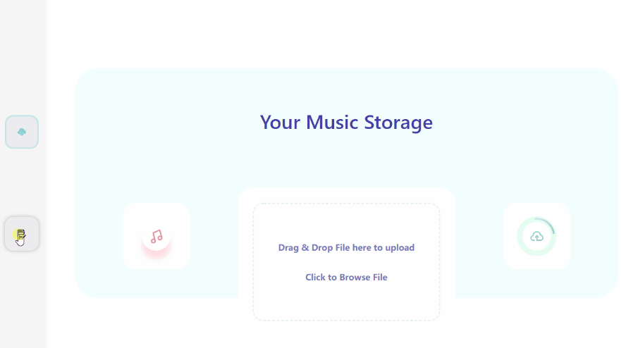

# simple-music-server


## Usage

  1. **make sure you have [node](https://nodejs.org) env**

  2. **clone / download project**

  3. **install node_modules**

     ```bash
     # yarn
     yarn
     
     # npm
     npm install
     ```

4. **open your terminal**

   ```bash
   node ./bin/www
   ```

5. **open http://localhost:39999 in your browser(chrome/firefox/edg/ie10+)**


## Preview(CDN)


## Preview(Github)

### upload file



